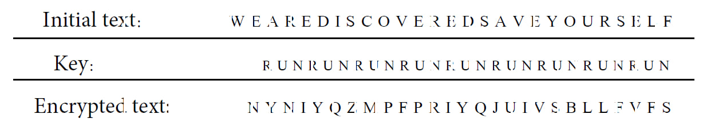

# Genetic algorithm for decoding a text

## Encryption:
The purpose of encryption is to convert the raw text (message) into ciphertext so that no one but the recipient of the message can understand it. The encryption used in this project is done using an encryption key and a table. 
The table can be seen here:

For this purpose, first a desired encryption key is selected. Then a new string is created using this key, and finally, using the Vigenère cipher table, the encrypted text is created. To start the encryption process, first a desired key is selected. This key will be repeated until it equals the text we want to encrypt in length. For example, if the text we want to encrypt is:

“WE ARE DISCOVERED SAVE YOURSELF”

and the key is "RUN,"  the initial string created will be:

"RU NRU NRUNRUNRUN RUNR UNRUNRUN" 

Finally, we will use the Vigenère cipher table to encrypt the text: 

## Genetic Algorithm:
In this project, an encrypted message and a reference text are given, and we have to find the desired key using the genetic algorithm and return the decoded message. Note that the encryption key in this project has 14 letters. Therefore, its calculations will take a very long time with trial-and-error methods on personal computers. So the use of genetic algorithms is very effective.

## Data:
The file global_text.txt contains lots of words with which we should help our genetic algorithm find the encryption key. The given .txt file was read, and only alphabetic characters, spaces, and " ' " characters were kept. Then stop words were removed and stored in a set of words separated by a space. All letters were also converted to uppercase.

## How to use:
1. Open .py file
2. Correct the link to global_text.txt
3. Run the code

